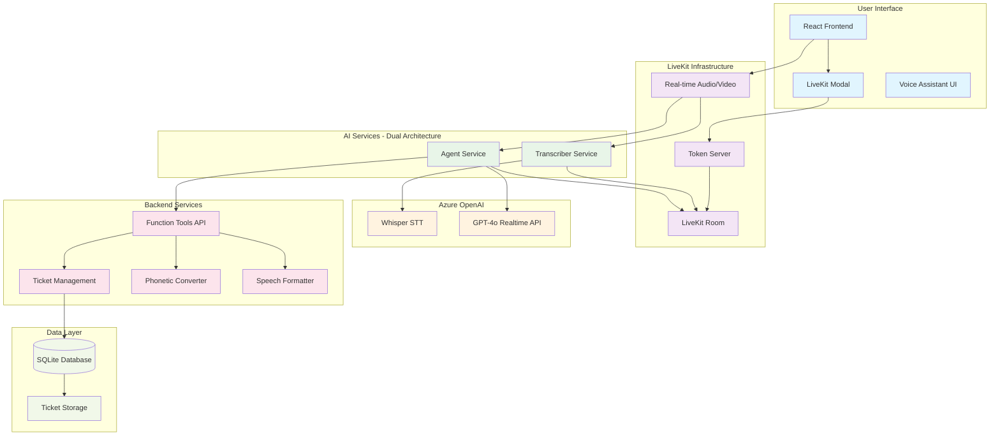

# LiveKit AI Service Desk Agent Architecture

@mermaid-chart

## Key Components

### Frontend Layer
- **React Frontend**: Modern web interface with Vite
- **LiveKit Modal**: User authentication and room connection
- **Voice Assistant UI**: Real-time transcription display with auto-scroll

### LiveKit Infrastructure
- **LiveKit Room**: Real-time communication hub
- **Token Server**: Secure authentication and room access
- **Real-time Audio/Video**: WebRTC-based voice processing

### Dual-Service AI Architecture
- **Transcriber Service**: Dedicated speech-to-text processing
  - Uses Azure OpenAI Whisper
  - Windows-compatible (no Silero VAD)
  - Publishes transcriptions to LiveKit room

- **Agent Service**: Intelligent response generation
  - Uses Azure OpenAI GPT-4o Realtime API
  - Handles function tools and ticket operations
  - Generates natural voice responses

### Azure OpenAI Integration
- **Whisper STT**: Enterprise-grade speech recognition
- **GPT-4o Realtime API**: Advanced conversational AI with function calling

### Backend Services
- **Function Tools API**: Async ticket operations (create, lookup, search)
- **Ticket Management**: Database operations and validation
- **Phonetic Converter**: "Golf-Delta-Kilo" → "GDK" transformation
- **Speech Formatter**: Clear pronunciation of ticket numbers (zeros emphasized)

### Data Layer
- **SQLite Database**: Ticket storage with auto-generated incident numbers
- **Ticket Storage**: Complete ticket lifecycle management

## Architecture Benefits

1. **Separation of Concerns**: Transcription and response services operate independently
2. **Scalability**: Services can be scaled based on demand
3. **Reliability**: Failure in one service doesn't affect the other
4. **Maintainability**: Clear boundaries enable easier updates and debugging
5. **Enterprise Ready**: Azure OpenAI integration ensures security and compliance
